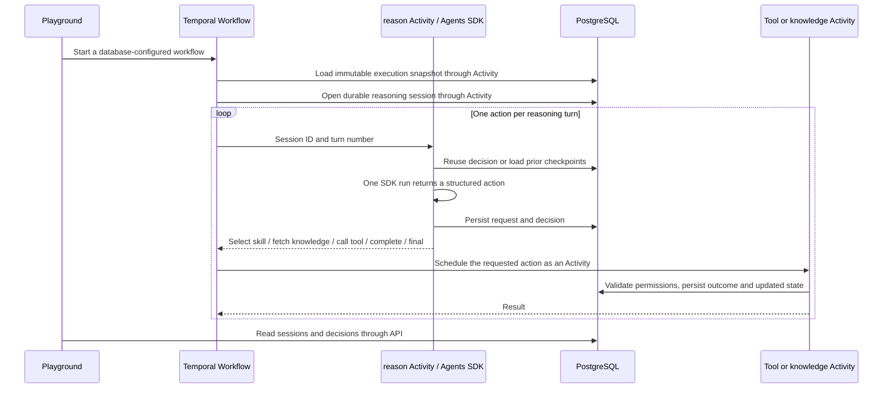

# Agent sessions and the playground

The engine now supports OpenAI Agents SDK execution with model-selected skills, explicit tool/knowledge requests, and durable per-turn sessions. The web playground is served by the API at http://localhost:3000. It lists all published workflows, including legacy and offline test workflows, and displays their configured execution mode. There is no model-mode toggle in the UI.

## Run it

```bash
pnpm install --frozen-lockfile
skaffold dev --cleanup=false
# Once the ports are forwarded, another terminal:
pnpm db:migrate
pnpm db:seed:agent
```

Put `OPENAI_API_KEY=your-key` in `.env.openai.local`, then run:

```bash
pnpm secrets:openai
```

The file is excluded from Git and Docker. The command loads `openai-secrets` and restarts the Worker. The key is never sent to the browser or stored in session snapshots. Only the Worker receives the Secret. Avoid quotes around the value in this Kubernetes env file. Deleting the namespace also deletes the Secret; reload it afterward.

Open the playground, choose **Agent Research — OpenAI**, edit the JSON input, and select **Run with OpenAI**. The current demo uses real OpenAI reasoning with synthetic property-tool data. It does not perform live property research or outreach.

Equivalent live command:

```bash
pnpm demo:agent -- --live
```

`pnpm demo:agent` exercises the same Agents SDK Agent/Runner with an offline model fixture for testing. OpenAI workflows fail explicitly if the key is missing; they do not silently fall back to a mock.

## Responsibilities



The SDK is deliberately configured with **no executable tools and no handoffs**. Its structured output proposes an action. Temporal schedules `applyAgentDecision`, `executeSessionTool`, or `fetchSessionKnowledge`, which validate and execute that action. This prevents an SDK-internal tool loop from escaping Temporal's Activity boundaries.

Each `reason` Activity invokes an actual `@openai/agents` Agent/Runner with one turn, structured output, timeout, and an explicit model. The session transcript is application-owned: input plus prior decisions/results are reconstructed from committed database rows on every model call. It is not a hosted OpenAI Agents API session or an in-memory SDK Session object. No private chain-of-thought is requested or stored; the timeline contains brief public decision summaries.

## Skills and knowledge

An `agent_loop` WorkflowStep holds a list of exact `skillVersionIds`. These must belong to the organization or be global, and have `executionType=agent`. A fixed skill step can also reference an agent SkillVersion directly. The full catalog is pinned when the Run loads its execution definition.

The model initially sees catalog names, descriptions, and input schemas. After `select_skill`, it receives the active skill's detailed instructions/output schema and allowed tool definitions. It must complete the active skill before selecting another, and complete at least one skill before final output. The model cannot add arbitrary workflow steps or select skills outside the pinned catalog.

Skills declare `allowedToolIds` and `allowedKnowledgeIds`. Tool-specific trusted configuration is stored under `toolConfigurations[toolId]`; model arguments cannot overwrite it. Tool arguments/results and skill/final outputs are schema-validated.

Knowledge is snapshotted with the Run. The model sees only permitted knowledge IDs/names until it requests `fetch_knowledge`; that Activity returns the pinned content and records it in session context. The UI distinguishes **Available** from **Fetched**, and can preview either. Fetching means retrieval from the immutable snapshot, not a new search against mutable organization knowledge or a vector database.

## Persistence and recovery

- `reasoning_session`: one per Run/WorkflowStep, immutable input/configuration snapshot, status, output, pending review ID.
- `reasoning_turn`: immutable request/decision, one-time outcome containing updated state and action result, timestamps; unique on Session/turn.
- Temporal history: each model turn and execution is a distinct Activity. The parent remains `AgentRunWorkflow`.

The first committed model decision is reused if an Activity response is lost. Completed tool/knowledge outcomes are also reused. Database row locks serialize duplicate attempts. A crash before the external call's result is committed can still repeat that call: this is **at-least-once execution**, not exactly-once. Agent tools must be registered with `retrySafe: true`; write adapters must actually honor the supplied stable `sessionId:turn` idempotency key before making that declaration. The included adapter is a repeatable, synthetic read.

The model call itself may be repeated if a crash occurs after OpenAI responds but before the database commit. That can incur another model charge. Current checkpoints protect committed turns; they cannot atomically commit across OpenAI and PostgreSQL.

Human review pauses the session/Run and records a `reviewId` unique to that turn. The review API requires that current ID, preventing a stale approval from authorizing a later request. Approval resumes the session with the recorded human result; rejection/timeout fails it. Cancellation records a cancelled session through non-cancellable cleanup.

## Bounds and configuration

WorkflowStep configuration includes `provider`, `model`, `maxTurns` (default 12, maximum 50), `maxToolCalls`, `maxSkillSelections`, `maxContextBytes`, `maxOutputTokens`, and `allowHumanReview`. `outputSchema` can override the step's final contract. Limits are validated and persisted when the session opens. Runtime `AGENT_PROVIDER`/`AGENT_MODEL` can override defaults for new sessions only; avoid global provider overrides when running the offline test suite. No such override is needed for the live seeded workflow.

SDK tracing is disabled; the playground uses local business events and Temporal history. There is no cross-run memory, conversation compaction, arbitrary dynamic DAG generation, or production access control. The local database stores bounded transcripts, not hidden reasoning. Agent sessions use at most 20 pinned skills, with explicit per-skill tool/knowledge allowlists.

## Playground and API

The UI shows recent runs, inputs, final output, per-turn actions, public summaries, tool arguments/results, skill versions/instructions, available vs fetched knowledge, pending approvals, and up to 200 recent Temporal event summaries.

- `GET /` — playground listing all published workflows
- `GET /workflows/:id/runs` — recent runs for that workflow
- `GET /runs/:id/sessions` — session summaries
- `GET /sessions/:id` — pinned snapshot, decisions, outcomes and latest state
- `GET /runs/:id/history` — compact Temporal event summaries, including Activity names
- `POST /runs/:id/review` — existing endpoint; agent sessions also require `reviewId`

The API remains local and unauthenticated. Production identity and authorization must precede public exposure.

## Verification

```bash
pnpm typecheck
pnpm test
pnpm test:integration
# Includes a real Worker restart while a synthetic session waits for human review:
TEST_WORKER_RESTART=1 pnpm exec tsx --test tests/integration/agent-session.test.ts
```

Tests exercise the real SDK parser with an offline Model, allowlist rejection, input/output contracts, explicit knowledge retrieval, database immutability, cached turn/tool outcomes, stale-review rejection, and restart recovery. Live OpenAI execution is tested separately through the live workflow, rather than making paid calls part of the normal test suite.

Validated locally on 2026-09-15: typecheck, 6 unit tests, 7 integration tests, and a Worker restart during human review passed. Live OpenAI Run `23b6861d-3368-424c-986a-049af7911b20` completed five turns: select skill, fetch knowledge, call tool, complete skill, final. Its session is `eb2eccd3-e86f-40a3-bd13-e6bc923103ee`. The playground script parses; visual browser verification was blocked by an unavailable admin-policy security check.

## Conversations with a human

The `ask_human` action is separate from approval. The model proposes `{question, options?}` as its JSON payload, with a null target. A `prepareHumanQuestion` Activity validates the question, then Temporal marks the session and step waiting. The Runs page displays the question, optional suggested answers, and a free-text reply box. `POST /runs/:id/answer` requires the current `questionId` and an `answer` of 1–12,000 characters; it sends the durable `humanAnswer` signal. Blank or stale replies are rejected. Suggested options do not restrict free-text replies.

The answer is recorded in the reasoning turn outcome and included in subsequent model context. The model can ask follow-up questions on later turns. The original question and replies appear in the timeline. Worker restarts preserve the pending question and signal history. Questions expire after seven days and remain bounded by the session's turn/context limits. This is model-initiated conversation, not an unsolicited chat channel during tool execution.

New sessions permit questions unless `allowHumanQuestions` is false. The builder exposes **Allow the model to ask humans questions** alongside its separate approval setting. Already-persisted session configurations retain their existing capabilities. An answer supplies information; it does not approve a review or grant new tool permissions. Duplicate signals for the same question use the first reply accepted by the workflow.

`GET /runs/:id/question` returns the currently pending question, independently of which historical step session is selected in the inspector. No additional database table is needed: the question is the immutable decision, the reply is its committed outcome, and Temporal preserves the wait and signal.

Validation: 8 unit tests and 10 integration tests passed, including a restart during a pending question, two replies carried into later reasoning, and rejection of stale/blank replies and mistaken approvals. Live OpenAI Run `640d2ffa-c076-4201-ba07-1f122dce340b` asked two questions and completed a brief using both test replies.
