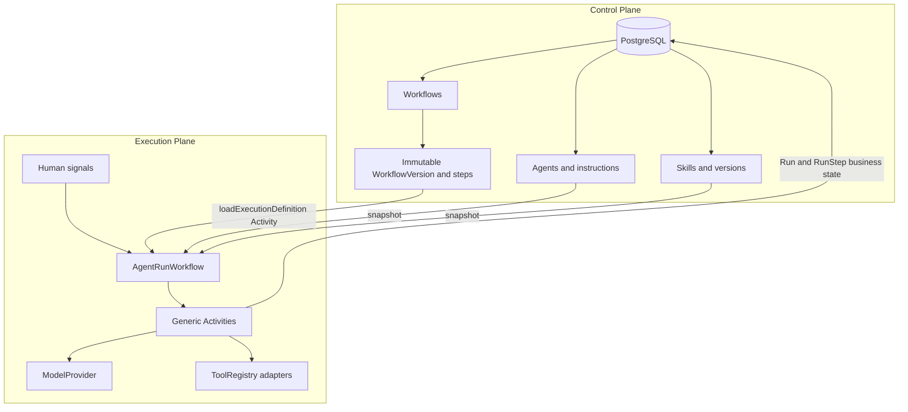
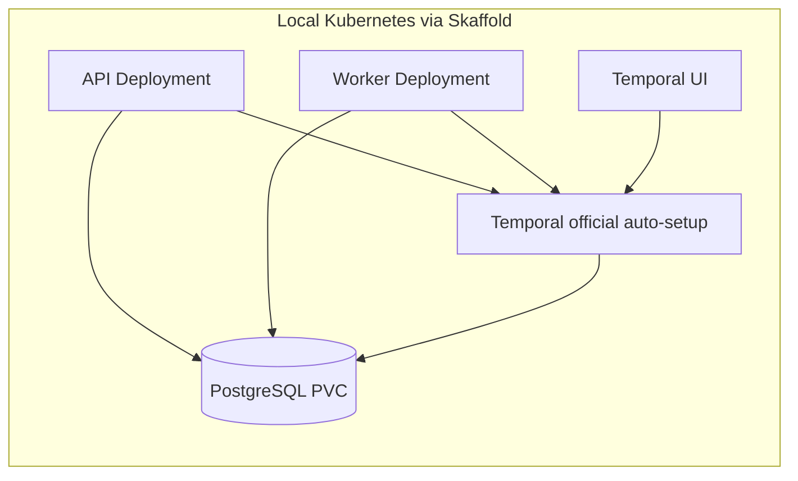
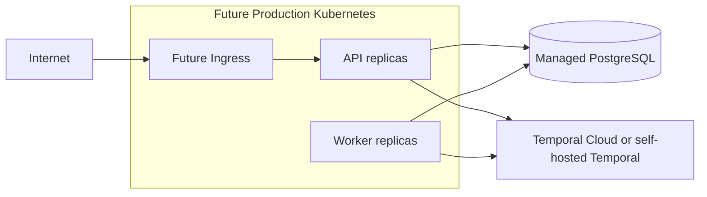

# Architecture

See [Agent sessions and the playground](agent-sessions.md) for the implemented OpenAI SDK reasoning loop, model-selected skills, knowledge retrieval and session persistence. The original sequential execution path below remains supported.

Code defines how the engine executes work. The database defines how a particular business works. Temporal provides durable execution.

PostgreSQL describes the business process. Temporal durably executes the business process. Activities perform external side effects. Skills are reusable business capabilities. Tools are executable integrations. Runs reference immutable WorkflowVersions.

## Boundaries

- `apps/api`: Fastify endpoints, Task/Run creation, durable pending-run dispatch to Temporal.
- `apps/worker`: worker composition and demo adapter registration. Separate process/deployment.
- `packages/database`: 13 product tables, relationships, Drizzle client and migrations. A small internal seal table remembers published workflow versions.
- `packages/shared`: serializable contracts and a deterministic input binding function.
- `packages/engine`: schema validation, ToolRegistry, provider abstraction, deterministic mock, optional OpenAI adapter.
- `packages/temporal`: one Workflow, generic Activities, connection configuration.
- `scripts/seed.ts`: business SOP, skill instructions, fixtures and bindings. No business dispatch exists in core packages.

For Day 1 the workspaces share one compiler configuration and root dependency lockfile; imports are explicit relative package paths. They are private source workspaces, not independently published libraries.

## Execution

1. API selects the current version, validates input and resolves an agent within the same organization.
2. A database transaction creates Task and Run, permanently pinning the version/input/Temporal ID.
3. API starts `AgentRunWorkflow`. A five-second pending-run sweep repairs a crash between commit and start. Temporal rejects duplicate workflow IDs, including completed executions while their history is retained.
4. `loadExecutionDefinition` locks the Run and reads workflow, ordered steps, exact SkillVersions, tool metadata, agent instructions and organization knowledge in a repeatable-read transaction. It saves the complete snapshot once; retries reuse it. The Activity result is also in Temporal history.
5. Workflow iterates the stored steps. `inputFrom` supports `initial`, `previous` (default), `context`, or `steps.<key>` whole-value bindings. No arbitrary expression evaluation or business branching.
6. `executeSkill` validates skill input/output, and invokes a ModelProvider or the generic `executeTool` adapter dispatch. The latter also validates tool input/output. Tool execution occurs inside the skill Activity boundary; both are registered as generic Activities.
7. `saveRunStep` upserts one business row per Run/WorkflowStep. Completion/failure updates Task and Run together. The last step's result is the Run output and must match the workflow output schema.

## Immutability

Database triggers reject WorkflowVersion/SkillVersion updates and deletes. Steps are append-only during construction, then sealed when a version is published or used. Publication checks that the version belongs to its Workflow. Old versions stay sealed after a new version is published. Parent-row locks serialize step construction and publication. Runs cannot change Task/version/input/Temporal identity or replace a populated definition snapshot.

Agent, Knowledge and Tool records are mutable configuration. Their values are frozen at the first successful definition-loading Activity, not at HTTP submission. Skill execution uses the snapshot and never re-reads mutable configuration mid-run. Tool code and provider environment are deployed code/configuration, not historical binaries: changing an adapter or model can affect an outstanding Activity. Future production worker versioning must address that explicitly.

## Skills and tools

`Tool.handler` is a string resolved through `ToolRegistry`. A `SkillVersion` with `executionType=tool` stores a `configuration.toolId` binding. The database chooses capability, instructions, schemas, and inputs; code supplies the executable adapter.

The only demo adapter is in `apps/worker/src/demo-tools.ts`. Its synthetic property results come from skill configuration. Mock LLM responses likewise come from `configuration.mockResponse`, allowing unrelated workflows with no engine modifications. Mock mode returns fixtures verbatim; it does not interpret instructions or generalize to arbitrary input.

## Durability and side effects

Temporal = execution ledger. PostgreSQL = business state. We store business statuses/results, not every Temporal event.

Workflow code does not access PostgreSQL, files, HTTP, environment variables or model services. All such operations are Activities or worker/API startup code. Activity retries are bounded to three attempts, with a two-minute attempt timeout and ten-minute overall schedule timeout. Database result writes use stable keys/upserts. Deterministic demo adapters are safe to repeat. Real external integrations will need provider idempotency before enabling writes; Temporal Activities are at-least-once, not exactly-once.

Cancellation is handled in a non-cancellable cleanup scope to record a cancelled Run/active step. Abrupt Temporal termination bypasses Workflow cleanup; reconciling manually terminated executions is not implemented. If PostgreSQL remains unavailable beyond cleanup retries, Temporal history is authoritative and product state requires reconciliation.

## Human review

A configured `human_review` step records waiting state and waits up to seven days for `humanReview({stepKey, approved, note})`. The API accepts signals only for the waiting step. First matching decision wins. Rejection or timeout fails the step and Run; approval resumes and stores the decision in the step output. `Correction` is a separate storage model; no automated learning or correction UI is built.

The seed ends with a report requiring human review. It has no outreach capability and no blocking review step, so its automated acceptance run completes. Integration tests exercise a separate workflow with a blocking review step.

## Deployment

Local Temporal runs its services in one process using the official auto-setup image, with PostgreSQL persistence and visibility databases. It is intentionally a development topology. The local setup does not use a production HA Helm deployment.

Only `DATABASE_URL` reaches the application. AWS RDS, Google Cloud SQL, Azure Database for PostgreSQL or another managed service can replace local PostgreSQL without code changes. Temporal Cloud uses `TEMPORAL_ADDRESS`, `TEMPORAL_NAMESPACE`, `TEMPORAL_TLS=true`, `TEMPORAL_API_KEY`, and the same queue. Base manifests require environment-owned `engine-config` and `engine-secrets`; the production placeholder intentionally omits credentials, ingress, and infrastructure provisioning.

## Reference points

- [Official Temporal auto-setup source](https://github.com/temporalio/docker-builds/blob/main/docker/auto-setup.sh): local schema setup and persistence configuration.
- [Skaffold configuration](https://skaffold.dev/docs/references/yaml/) and [port forwarding](https://skaffold.dev/docs/port-forwarding/).
- [OpenAI Chat API reference](https://developers.openai.com/api/reference/resources/chat): optional adapter JSON mode; local schema validation is still required. This optional path has not been live-tested with credentials.
