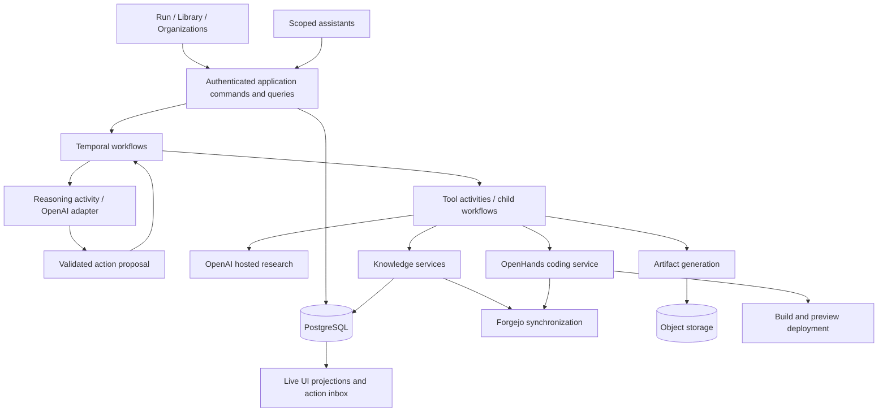

# revOS — self-contained product rebuild prompt

Prepared September 17, 2026. This is a proposed rebuild specification, informed by the existing prototype and its product conversation. It describes the desired product; statements about the prototype appear explicitly in section 24. The implementation must not assume the improvements below already exist.

Reading guide: sections 1–6 define the product and UX; 7 preserves the discovery business process; 8–14 cover reviews, outputs, knowledge, leads, products, and assistants; 15–20 define the engineering approach; 21–25 specify delivery, tests, migration, and the starting inventory.

## 1. Your assignment

Act as the product designer and principal engineer rebuilding **revOS**, a platform for turning customer understanding into evidence, commercial proposals, and working products through durable, human-guided agent workflows.

Build a coherent product with a usable interface, reliable execution, and a clear data model. Preserve the capabilities described here while replacing prototype shortcuts. This document must be sufficient to begin without the original conversation.

The central customer journey is:

**Understand the customer → Research the opportunity → Agree on a proposal → Build and improve a product.**

Each stage combines agent work, tools, customer knowledge, human questions, readable deliverables, and explicit decisions. The result can be a presentation, a lead qualification tool, another interactive product, or several of these together. Learning continues after the first build.

Design the experience around the customer, current objective, work produced, and next decision. Keep model turns, raw JSON, Temporal events, and infrastructure controls in an accessible technical inspector.

If an existing repository is available, inventory it first and preserve its data and history. If starting fresh, implement the same product contracts and use synthetic fixtures. Make reasonable implementation decisions, record them, and progress through the delivery slices below. Raise questions only for decisions that materially change the product, require unavailable credentials, or authorize consequential actions. Produce working vertical slices, not a set of disconnected screens.

## 2. Product principles and terminology

1. **Economic value comes before technology.** Discover how the customer earns money, loses value, qualifies opportunities, and measures success before recommending software.
2. **Agents choose; the engine controls execution.** Models select permitted skills and actions. Temporal coordinates durable execution and human waits. Policy and authorization are enforced by application code.
3. **People participate throughout the work.** Questions, corrections, revisions, lead qualification, and approvals are normal states, not exceptional failures.
4. **Deliverables are the primary result.** Structured data enables useful views, documents, diagrams, products, and downstream workflows.
5. **Every important result has provenance.** A user can trace a claim, artifact, review, product version, or knowledge update to its sources and execution.
6. **Versions are explicit.** Published definitions, submitted deliverables, decisions, and execution snapshots are immutable. Changes create revisions.
7. **Customer boundaries are explicit.** Resolve the customer before retrieving or writing their knowledge. Never infer access from a model-generated organization ID.
8. **One product model supports all interfaces.** Forms, assistants, tools, APIs, and repository events use the same application commands and policies.
9. **Business definitions are configuration.** No conditional engine code keyed to a workflow name, industry, or customer.
10. **Complexity must earn its place.** Start with a modular application, separate workers, and a few clear services. Avoid unnecessary microservices, Kafka, a service mesh, or a graph database.

Use these terms consistently:

| Term | Meaning |
| --- | --- |
| Workspace | The tenant operating revOS; owns users, permissions, connections, and reusable library content. |
| Organization | A customer or prospect whose knowledge, engagements, leads, and products belong together. Distinct from the workspace and an OpenAI account organization. |
| Workflow | A reusable, versioned definition of a bounded business process. |
| Workflow run | One execution of a pinned workflow version with specific inputs. |
| Workflow chain | A reusable, versioned sequence of workflows, typed handoffs, and review gates. |
| Engagement | An organization's running instance of a workflow chain toward a business objective. |
| Stage attempt | One attempt at a chain stage; requesting a complete stage rerun creates another attempt. |
| Step | A unit of work inside a workflow, such as an agent task, fixed skill, or human checkpoint. |
| Skill | Versioned instructions, input/output contracts, tool permissions, knowledge access, and output preferences. It is not an executable integration. |
| Tool | A registered capability with executable code or an adapter, schemas, permissions, and a retry contract. |
| Agent session | Durable conversational/execution state for an agent task or revision cycle. A model is not an SDK, and a workflow is not one giant SDK session. |
| Deliverable | A business result, such as an opportunity brief, evidence report, proposal, or product specification. |
| Presentation | A readable view of a specific deliverable revision. |
| Artifact | A retained file representing a result: PDF, spreadsheet, slides, image, or other supported export. |
| Product | A persistent customer-owned tool or site with requirements, source, versions, builds, deployments, and feedback. |

Core relationships:

```text
Workspace
├── Library: chains, workflows, skills, tools, reusable reference knowledge
└── Organization
    ├── Engagement → Stage attempt → Workflow run → Step attempt → Agent session
    │                                                   └── Skill/tool executions
    ├── Knowledge → Evidence, records, revisions, corrections, mind map
    ├── Deliverables → Versions → Presentations, artifacts, reviews
    └── Products → Versions → Source revisions, builds, deployments, previews
```

Standalone workflow runs remain supported and may also belong to an organization. Do not require an engagement for every task.

## 3. Users and the product loop

Support operators, workflow authors, reviewers, customer collaborators, and administrators through capabilities. One person can hold multiple roles. Permissions apply on the server regardless of which UI or assistant initiates an action.

The normal loop is:

1. Select or identify a customer and a business objective.
2. Start an engagement from an understandable form.
3. Agents use available knowledge, select skills, research, and ask focused questions.
4. The operator or customer responds inside the same workspace.
5. Agents produce a readable result with evidence and unresolved questions.
6. A person approves it, requests changes, pauses, or stops.
7. Approval advances the configured workflow or stage; corrections create another review cycle.
8. Relevant findings become organization knowledge with their actual evidence status.
9. Approved requirements become a presentation or working product through a traceable build pipeline.
10. Customer feedback improves both organization knowledge and the relevant product.

Example: an operator starts discovery for a property services business, corrects what makes a qualified lead, reviews an updated opportunity brief, approves deeper research, compares sourced lead candidates, and requests a small qualification tool. The tool has a preview and source repository. Customer qualification decisions return to the knowledge base and inform subsequent work.

## 4. Navigation and visual design

Keep a consistent application shell with **Run / Library / Organizations** as the three primary tabs. Preserve their shape and location across routes. Add a persistent **Needs your input** indicator. Provide Temporal, OpenHands, and Forgejo links in a compact Services control in the header, with configured URLs and connection state.

### Run

- Separate **Engagements**, **Workflow runs**, and **Needs your input** views.
- Engagements list customer, objective, chain, current stage, status, last activity, and next action.
- Standalone workflow runs have their own launch and history view; never overlay them ambiguously on an engagement timeline.
- Needs your input collects questions, review requests, customer identity ambiguities, knowledge conflicts, and change proposals. Every item names its customer, target, scope, and waiting reason.

### Library

Separate tabs for **Workflow chains / Workflows / Skills / Tools / Reference knowledge**. The Reference knowledge tab contains reusable methodology and reference material, not customer-specific knowledge.

### Organizations

Start with a customer directory. Each organization has dedicated **Overview / Knowledge / Mind map / Products / Engagements / History** views. Products must have room for a useful preview; do not force a document sidebar into every organization screen.

### Interaction rules

- Use clear headings, restrained status colors, readable typography, strong empty states, and one obvious primary action per workspace.
- Never require raw JSON for normal start, question, feedback, review, or authoring flows. Preserve an optional developer view.
- Put identity and context in the page: organization, engagement, stage, attempt, selected deliverable version, and live/historical status.
- URLs identify selected resources and revisions; refresh, back/forward, and shared links restore the same view.
- Live updates must not erase drafts, move focus, reset scroll, or change the target of a pending action.
- Assistant and document areas have independent, predictable scrolling. Do not nest competing full-height scroll containers or cover the composer with messages.
- A user who scrolls up to read chat sees a new-message indicator rather than being forced to the bottom.
- Support keyboard navigation, labeled controls, accessible status updates, readable contrast, and narrow layouts. Do not communicate state only through color.
- Show loading, empty, stale, unavailable, failed, cancelled, and retry states deliberately. Avoid optimistic “success” when persistence has not completed.

## 5. Engagement workspace and intake

An engagement has its own page, not a panel injected above an unrelated run inspector.

```text
Customer / Engagement                         Status · Current action
Understand → Research → Proposal → Product

Overview | Work | Deliverables | Decisions

Review opportunity brief — revision 3
What changed · Summary · Evidence · Unknowns · Artifacts

Approve this version | Request changes | Pause
Execution details and service links are secondary controls.
```

Stage labels come from the selected chain; support multiple chains with different stages. The four-stage journey is an initial template, not a global assumption.

Selecting a stage shows its attempts and deliverables. A historical attempt is visibly historical and does not inherit the current attempt's approval buttons. Current actions belong beside the result they affect.

Use one reusable, versioned form system for engagement intake, standalone runs, draft tests, and human questions:

- JSON Schema for data validation plus UI metadata for labels, help, examples, groups, order, units, defaults, and conditional fields.
- Scalars, enums, dates, URLs, booleans, repeatable rows, nested objects, references, and authorized file attachments.
- Explicit supported schema subset; reject unsupported form definitions at publish time rather than silently degrading required fields into broken controls.
- Save draft, resume, field-level errors, and final input summary.
- Organization selection, create new organization, or identify from submitted context. Show ambiguous matches for resolution.
- Explain expected deliverables, human checkpoints, available integrations, and execution budget before start.
- Treat internal orchestration fields as internal. Authors configure business intake, not `engagement` transport wrappers.
- Render sensitive fields appropriately; secrets are connection settings, never ordinary intake data.

## 6. Workflow and chain authoring

### Workflow definition

Include name, business goal, instructions, input schema/form, output schema, steps, typed input mappings, presentation preferences, artifact policy, review policy, model profile, budgets, and knowledge policy.

Step types initially include:

- Agent task with model-selected skills.
- Fixed skill execution.
- Human question or review checkpoint.
- Explicit tool execution when a deterministic integration step is appropriate.

An agent task chooses among pinned permitted skills and tools within configured limits. Required evidence or skill obligations are validated by the engine, not only mentioned in a prompt.

Choose skills using a searchable dropdown and removable pills. Show details on demand; do not repeat the complete catalog inside every step. Tools and reference knowledge have similar compact selectors and visible availability.

Authors can edit, validate, test, inspect results, compare versions, publish, archive, and clone. Drafts use optimistic concurrency. Publishing pins exact skill and reference versions plus tool contracts, model settings, and schemas. A tested draft hash must match the published revision; require retesting after material changes. Existing runs retain their original definition snapshots.

### Workflow chains

A chain has its own editor and immutable published versions. Support multiple chains. Include ordered stages, pinned workflow versions, an engagement intake form, required deliverables, input/output handoff mappings, reviewer policies, and advancement conditions.

Provide stage add/remove/reorder, a readable handoff mapping editor, sample mapping preview, and validation of required fields and schema compatibility. A chain may end early when its configured outcome is reached. Begin with ordered stages and explicit conditions; defer a general graph canvas until real cases require it.

Approval of a configured stage gate starts the next pinned workflow once. The handoff uses the approved deliverable versions, approved feedback, customer identity, and allowed knowledge snapshot. Never pass an unbounded copy of every previous result.

Publishing changes future engagements. Updating an active engagement requires an explicit migration command and compatibility check; never silently switch its versions.

## 7. Initial business templates

Preserve the existing **Customer Opportunity Discovery** definition and its historical versions/runs. Add a new chain and workflows for the four-stage journey. Do not overwrite the old definition to make it resemble the new one.

Use a reusable **Customer Opportunity Strategist** agent profile: understand economics, prioritize measurable outcomes, apply 80/20 research, account for customer capacity, distinguish evidence from assumptions, and ask the questions most likely to change the recommendation. Prefer customer-provided revenue, conversion, and unit-economics data over generic market assumptions, while preserving its source and verification status.

### Stage A — Understand the customer

Perform initial research, understand the customer and landscape, prepare interview questions, collect responses, identify constraints, define a valuable opportunity, and establish initial hypotheses.

Deliver: customer profile, revenue model, current operations, ideal lead/qualification draft, economic opportunity hypotheses, evidence/unknowns, and proposed research plan. Gate: is the understanding accurate and is deeper research worthwhile?

### Stage B — Research

Investigate the highest-value uncertainties, sources, competitors, economics, workflows, and timing. Ask follow-up questions. Collect evidence and real candidate leads when sources support them. Produce diagrams or small exploratory prototypes where they answer a question.

Deliver: evidence report, ranked opportunities, source assessment, qualification model, relevant lead candidates, validated assumptions, and a recommended direction. Gate: which opportunity and evidence are sufficient for a proposal?

### Stage C — Proposal

Translate approved findings into the smallest valuable engagement. Specify scope, measurable outcomes, assumptions, success metrics, implementation phases, customer responsibilities, pricing/compensation alternatives, attribution, and risks. A presentation, mockup, or preview can help explain the offer.

Deliver: customer-facing proposal plus structured scope and acceptance criteria. Gate: approve the exact scope and terms to guide product work. Internal approval is not a signed customer contract; record who agreed to what.

### Stage D — Product

Use approved requirements and organizational knowledge to build an initial tool or site. Run tests, publish an authorized preview, gather customer feedback, and iterate. OpenHands may also be used in Research and Proposal; do not restrict it to this stage.

Deliver: product requirements, source revision, test/build evidence, working preview, known limitations, and next iteration plan. Gate: accept the version, request a revision, or pause. Production release is a separate deployment decision.

### Preserve the original discovery's business coverage

The original sequence covers twelve business steps. Preserve all of them across the new templates, allowing depth to vary by stage:

1. Understand the customer, revenue, problem, constraints, and unanswered questions.
2. Find economic value: losses, inefficiencies, unserved demand, and low-effort opportunities.
3. Define the ideal lead/opportunity, qualification/disqualification, thresholds, timing, capacity, and future WATCH conditions.
4. Map sources: existing customer data, inbound/outbound, public data, industry databases, referrals, affiliates, vendors, representatives, sites, events, public records, and marketplaces. Assess access, cost, quality, volume, API availability, and feasible automation.
5. Understand competitors, representatives, brokers, vendors, affiliates, compensation, and neglected/rejected/abandoned/unclosed opportunities.
6. Audit website, digital footprint, CRM, receptionist/front desk, inbound/outbound, pipeline, follow-up, analytics, software, and referrals. Recommend a CRM or receptionist only when linked to value.
7. Research relevant market size, trends, seasonality, boom/bust conditions, adoption, behavior, and applicable economic/regulatory factors. Stop when further research is unlikely to change the decision.
8. Consider revenue opportunities such as generation, enrichment, qualification, WATCH monitoring, follow-up, CRM, receptionist, research, matching/routing, referrals, and participation in closing. Rank them rather than recommending everything.
9. Prioritize by customer value, revenue potential, confidence, measurability, effort, time to value, capacity, and competitive difficulty. Show best, second-best, watch, and ignore-for-now opportunities.
10. Design the offer, deliverable, outcome metric, smallest useful scope, required customer data, what not to build, positioning, pitch, proof, communication channel, follow-up timing, and no-response plan.
11. Compare fixed fee, retainer, per lead, per qualified lead, per closed deal, revenue share, and hybrid compensation; include tracking, attribution, capacity, upside/downside, and alignment. Assess whether excess or unclosed opportunities exceed the customer's closing capacity and whether routing to other providers or participating in closing could change the economics. This is analysis; actual routing or outreach requires separate authorization.
12. Obtain human review of assumptions, ranking, qualification, recommended offer, and compensation before advancing.

Use `(value × confidence × measurability) / (effort × time_to_value)` only as a conceptual prioritization aid. Define scoring scales if displayed; avoid false numerical precision.

Create these thirteen reusable skills, with contracts and appropriate permissions:

`understand_customer`, `map_revenue_model`, `identify_value_opportunities`, `define_ideal_lead`, `design_qualification_model`, `discover_lead_sources`, `analyze_market_participants`, `audit_customer_operations`, `analyze_market_trends`, `identify_revenue_streams`, `prioritize_opportunities`, `design_offer`, `design_compensation_model`.

Create versioned reference knowledge named **Discovery Principles** and **Lead Qualification Principles** covering the commercial principles above, customer-specific qualification, capacity, future WATCH events, and learning from closed/won/lost outcomes.

### Intake and Customer Opportunity Brief contract

Initial discovery intake: required `customer_name` and `initial_problem`; optional `company_name`, `industry`, `website`, `conversation_notes`, `known_lead_type`, `known_revenue_model`, `existing_tools[]`, `existing_data_available`, and `additional_context`. An explicitly selected organization can supply known identity fields. Preserve older versions' actual schemas during migration.

The brief must retain the following semantic fields, with unknowns explicitly represented:

| Section | Required content |
| --- | --- |
| customer_profile | Company, industry, what they do, target customer, business model, constraints. |
| current_revenue_model | Revenue streams, how the customer gets paid, known unit economics, unknowns. |
| ideal_lead_definition | Definition, qualifying and disqualifying criteria, priorities, value thresholds, capacity, current and recommended qualification formula. |
| lead_lifecycle | Current statuses, handling of unqualified/unclosed leads, future qualifying events, recommended WATCH conditions. |
| lead_sources | Per source: name, type, estimated volume/quality, accessibility, automation potential, cost, evidence, confidence. |
| current_operations | CRM, inbound/outbound, front desk, follow-up, sales, existing software, affiliate/referral program, operational gaps. |
| market_landscape | Competitors, representatives, vendors, affiliates, compensation, trends, practices, tools, underserved segments, undercapitalized opportunities. |
| opportunities | Per opportunity: name, description, customer value, revenue potential, confidence, effort, time to value, measurability, capacity, risks, required data, next validation, priority. |
| recommended_offer | Offer, problem solved, deliverable, success metric, expected value, implementation scope, rationale, what not to build yet, sales approach. |
| compensation_options | Structure, alignment, upside, downside, attribution and tracking requirements. |
| discovery_gaps | Unanswered questions, data requested, assumptions to validate, next customer questions. |
| recommended_next_action | A concise decision and next action with its rationale. |

This is reusable across industries. Synthetic obituary/mortgage and property lead scenarios are test fixtures, not hard-coded product logic or evidence of a live property-data integration.

## 8. Human questions, feedback, and review cycles

Use one human-interaction domain with distinct **Question**, **Feedback**, **ReviewRequest**, and **ReviewDecision** records.

`ask_human` is a durable interaction capability, not a skill. A skill can instruct an agent when to use it. The model supplies a focused question, context, optional choices or a form, and why the answer matters. The workflow waits without occupying a worker or holding a database transaction. The user replies in the UI; the reply is attributable, persisted, and delivered once to the correct waiting execution. Support follow-ups and attachment references.

Unsolicited feedback can arrive while work runs. Record it immediately and apply it at a safe reasoning boundary; show whether it is pending, incorporated, or conflicts with the current direction. A human answer or correction does not grant unrelated tool permission or automatically approve a deliverable.

### Review packet

Before enabling approval, show:

- Exact organization, engagement, stage/step, attempt, and deliverable version.
- What is being approved and why.
- The actual readable content and relevant artifacts.
- Supporting evidence, assumptions, unresolved questions, and limitations.
- Changes since the previous version, including whether requested feedback was addressed.
- Who may decide and what each action will do next.

Bind the request to an immutable review packet hash containing deliverable version IDs, artifact hashes, and relevant policy/version references. A late artifact or changed result cannot silently alter an approved packet. Cosmetic exports may appear later only when clearly outside the reviewed packet. Final workflow output must reference the accepted deliverable version; the agent cannot rewrite approved material afterward without a new review.

Actions:

| Action | Effect |
| --- | --- |
| Approve this version | Records approval of the displayed version and advances only its stated gate. |
| Request changes — revise this step/deliverable | Requires feedback; creates a revision cycle, regenerates affected results, and returns for review. |
| Request changes — rerun this stage/workflow | Requires feedback and input review; creates a new stage attempt/run using the pinned definition, relevant prior results, and feedback. |
| Pause | Suspends progression under the documented cancellation policy; preserves work. |
| Stop execution | Explicitly ends the selected run or engagement scope, preserving history. |
| Change future template | Opens a separate library draft; does not mutate the running definition. |

The workflow author configures allowed revision scopes and their dependency boundary. By default, requesting changes at a stage gate creates a **new stage attempt and workflow run**, using the same pinned workflow version, all its steps, and the submitted feedback. Show that scope before submission. A smaller deliverable/current-step revision is a separately labeled option only when its dependency boundary is supported. A deliverable revision must mark dependent outputs/reviews stale and rerun affected work or require revalidation. Never relabel an old output as newly approved.

Give each revision cycle its own bounded reasoning allowance and retain an overall engagement budget. Repeated feedback must not accidentally exhaust an invisible first-attempt turn counter. When a budget is reached, pause with a checkpoint and a clear continuation choice.

Stale, duplicate, unauthorized, and conflicting submissions must not advance execution. Feedback history and all previous versions remain inspectable. Approval of business adequacy does not automatically certify every claim as fact or authorize production deployment.

Use a reliable decision-delivery handshake: atomically save the ReviewDecision and its outbox command, return “recorded, awaiting application,” deliver the command ID, expected version, and review packet hash through a Temporal Update or Signal, and persist an accepted/rejected/applied acknowledgment. Reconcile lost responses and deduplicate delivery. A Signal send alone is not proof that the business transition was applied. The UI shows advancement only after the durable transition is acknowledged.

## 9. Deliverables, presentation, artifacts, and publishing

Separate four layers:

1. **Canonical result:** validated domain data with source references.
2. **Presentation specification:** semantic sections/components describing how to explain it.
3. **Artifacts:** files derived from a fixed result revision.
4. **Product:** a separately versioned interactive application using selected results and user inputs.

A result envelope should carry schema version, ownership, run/step/skill execution references, revision, title, summary, domain data, evidence references, assumptions, questions, presentation specification, artifact references, and lineage. The outer contract is consistent; different skills and workflow steps can have different validated domain schemas.

Support semantic UI components for executive summaries, findings, evidence, opportunities/leads tables, scorecards, timelines, process diagrams, recommendations, proposal scope, and product requirements. Agents may select components and provide schema-validated content; do not execute arbitrary model-generated UI code in the main application. Use a readable generic fallback for an unfamiliar schema.

Diagrams must have actual structured nodes/edges or another validated diagram definition. A grid of section cards is not a generated mind map. Tables support sorting/filtering and drill-down into evidence. Facts and assumptions are visibly distinguishable.

Each skill and step can configure output presentation and artifact preferences. Policies support required, optional, automatic, on-demand, and model-requested generation within budgets. Collect skill artifacts under their parent step and engagement deliverables without copying file bytes or losing provenance. Artifact generation has its own status and retry; an optional PDF failure must not rerun successful research. A required export may block its specific gate.

Support PDF, XLSX, PPTX, and PNG exports. Use deterministic renderers for common documents and charts; provide OpenAI Code Interpreter through an artifact adapter for custom generation. The SDK coordinates the request; Code Interpreter or a renderer creates the actual file. Retain files in object storage with hashes, content type, size, source revision, generator version, and a manifest. Validate outputs, render representative pages/slides, and check legibility, overflow, missing data, and links. Preserve editable structured sources where appropriate.

Do not convert every step into an image. Images are optional illustrations; exact business content stays readable, searchable, accessible, and correctable.

Generate a configurable **presentation site** from chosen approved deliverables: audience, branding, sections, evidence visibility, contact/intake or qualification actions, and sharing policy. A presentation can link to an interactive product. Private previews are the default; publish/share is an explicit, revocable action. Customer-facing views exclude internal prompts, infrastructure traces, private notes, and secrets.

## 10. Organization knowledge and Forgejo

For every customer-related run, resolve its organization before customer knowledge retrieval or writes:

- Prefer a permitted explicit selection.
- Otherwise combine normalized domains/identifiers, aliases, and structured identity evidence with a bounded model suggestion.
- Show ambiguous matches; do not create duplicates or merge customers based only on a guessed name.
- New organizations get their own knowledge namespace and repository mapping.
- Record resolution evidence and immutable execution ownership. A later correction uses an audited migration; it does not rewrite the original snapshot.

Automatically ingest useful step/skill results as provenance-bearing knowledge candidates or researched observations. Deduplicate semantically with reviewable merge proposals. Preserve raw source references. Protect customer-confirmed facts from silent replacement by newer model guesses. Conflicts become review items. Separate operator statements from customer-confirmed statements.

Knowledge includes customer profile, claims, evidence, sources, leads, opportunities, constraints, questions, decisions, proposals, product requirements, and product feedback. Track independent dimensions such as source type, verification status, confidence, and validity/observation dates. Evidence-backed does not mean permanently true. Retrieval must support historical snapshots and current accepted records.

### Choose clear storage ownership

Use PostgreSQL as the authoritative transactional store for accepted knowledge revisions, review state, identity, and current record heads. Forgejo is the portable, versioned, human-editable repository representation of that knowledge. Search indexes and mind maps are derived views. This is a deliberate design choice to prevent three independently editable copies becoming competing authorities.

Store meaningful Markdown/JSON with stable IDs, front matter, evidence references, revision metadata, and an index in each organization's Forgejo knowledge repository. Keep product source in linked product repositories. Large binaries belong in object storage with retained references and export/backup support.

Use an outbox and durable synchronization jobs for application changes. Track pending, committed, indexed, and failed states; a successful database edit is not proof of a Git commit. Never attempt an atomic database-plus-Git transaction or hold a database lock during network calls.

External Forgejo edits enter through authenticated webhooks plus periodic reconciliation. Validate schemas and ownership, identify base revisions, and create changes for review when required. Accepted changes pass through the same knowledge command path, refresh retrieval, and schedule derived views. Use optimistic SHA checks and explicit conflict resolution. Deduplicate app-originated webhook echoes. Repository access alone does not bypass application review rules or authorize unrelated customer access.

Imports and corrections can be automatically accepted only under an explicit policy for that record type/evidence state. Stage approval may wait for required knowledge conflicts to be resolved, but unrelated optional synchronization should have a clear status rather than silently stalling everything.

## 11. Mind maps, explanation, audio, and comprehension

Generate an organization mind map using an agent over **all eligible organization knowledge**, not fixed headings or only the latest run. At scale, process bounded batches and synthesize a hierarchical graph; do not stuff the complete repository into one prompt.

Store nodes, typed relationships, labels, evidence citations, confidence/uncertainty, and the knowledge snapshot fingerprint. The map should explain relationships between the business, opportunities, sources, constraints, decisions, and products. Record coverage and omitted/unprocessed records if generation is incomplete. A citation-backed uncertain relationship remains visibly uncertain.

Knowledge changes enqueue/coalesce regeneration. Stale completions cannot overwrite a newer snapshot. Keep the last successful map visible with an updating/stale indicator. Support zoom, collapse, search, filtering, source drill-down, and manual refresh. Layout can be deterministic; semantic relationships come from validated agent output.

The organization assistant can walk a person through a report/map, answer source-grounded questions, explain a product, ask comprehension questions, collect corrections, and propose updated knowledge. Support listen/read-aloud, pause/resume, speed, section navigation, and optional voice input with an editable transcript. Always offer text alternatives. Microphone capture is user-initiated; browser-only voice features need a clear fallback. Spoken feedback follows the same review and attribution rules as typed feedback.

## 12. Leads and customer qualification

Distinguish a **lead sourcing strategy** from an actual sourced lead inventory. Do not fabricate leads because a workflow asks for a table.

Support sourcing through registered, authorized adapters: customer imports, connected systems, licensed data providers, permitted public information, and OpenAI web research. Public research can supply evidence and candidates; it is not a guaranteed complete or accurate lead database. Display missing connections and unsupported sources honestly. Keep the legacy property search fixture clearly synthetic and out of live source choices.

Represent lead identity, source, observed time, evidence, organization ownership, qualification criteria/version, score explanation, status, and customer decisions. Deduplicate candidates and preserve provenance. Separate source observations from inferred attributes. Do not infer private facts from unrelated public signals.

Lead review UX presents useful cards/tables with qualification questions and actions: qualify, reject, defer/WATCH, correct, and explain why. Conceptual statuses include hot, qualified, watch, not qualified, and disqualified; define transitions rather than using labels as an implicit state machine.

WATCH conditions are explicit events or scheduled checks with source permissions, budgets, and stop rules. Customer feedback and closed/won/lost outcomes inform proposed qualification improvements; changing a published criterion is a reviewed version change, not silent model learning. Avoid generating more actionable leads than customer capacity supports. Do not send outreach or route opportunities to third parties merely because a discovery report recommends it.

## 13. Products, OpenHands, and previews

Create first-class **Product**, **ProductVersion**, **SourceRevision**, **CodingSession**, **Build**, **Deployment**, **Preview**, and **ProductFeedback** resources. Product identity and purpose exist before a build. A failed build is not a new unnamed product.

Product detail includes goal, customer, requirements, accepted scope, last successful preview, current work, versions, source/PR links, tests, feedback, and next action. Keep the last working deployment visible while a revision builds or fails. Feedback can target a product version, screen/element, or requirement and can also propose an organization knowledge correction.

Expose OpenHands through a provider adapter shared by workflow-triggered and interactive coding paths. It supports create, inspect, send feedback, pause/resume where supported, cancel, collect files, persist conversation/checkpoints, and link source changes. The persistent OpenHands canvas remains accessible, can list authorized Forgejo repositories, and can initiate changes through the same product pipeline.

OpenHands creates or changes code in an isolated workspace. **revOS coordinates approval, source/version tracking, validation, deployment, and preview URLs.** Do not treat a chat message saying “deployed” as deployment evidence.

Pipeline:

```text
Approved requirements + allowed knowledge snapshot + feedback
→ Coding session on a source branch
→ Source revision / pull request
→ Tests, scanning, and build
→ Immutable build artifact
→ Preview deployment and health check
→ Versioned preview linked to customer/product
→ Review and another revision, or approved release
```

Record provider IDs and actual runtime/model configuration. Correlate canvas work with organization/product/repository. External PRs or commits arrive through a repository bridge and produce review/build events; they do not silently change a published preview.

Start with static presentations and tools. Support a safe authenticated revOS API integration for persistent lead qualification/input capture. Never put a database credential, platform token, or broad repository token into generated browser code. Introduce arbitrary backend products only through an explicit supported runtime template with dependency build, credentials, migrations, health checks, logs, routing, rollback, and resource policy.

Use Kubernetes for coding sandboxes as the target architecture. Verify the currently supported OpenHands backend, licensing, durable workspace storage, canvas integration, networking, cancellation, and recovery before selecting it. If no suitable supported backend is available, report the precise gap and offer an explicit adapter decision; do not pretend a K8s-hosted canvas implies K8s-hosted coding sessions.

Avoid privileged containers and host Docker socket access in the target. Restrict filesystem and egress technically, use least-privilege short-lived credentials, and preserve checkpoints while cleaning idle compute. Use internal service DNS for service communication and configured external ingress for browser URLs. Local HTTP Git is an explicit development exception; remote Git uses TLS. Preview URLs come from deployment records, never a hard-coded localhost regex, and preview content runs on an isolated origin.

## 14. Assistants in every section

Implement one assistant framework with three visible scopes and server-enforced capabilities:

| Scope | Responsibilities |
| --- | --- |
| Run | Explain current work, prepare intake, start authorized runs, inspect progress, gather answers/feedback, present reviews, propose reruns, pause/resume, explain next stages. |
| Library | Explain and author workflow/chain/skill/reference drafts, inspect tool availability, propose multi-entity changes, validate/test, and prepare publication. |
| Organizations | Explain knowledge and mind maps, guide report walkthroughs, capture/correct information, show products/previews, prepare builds/revisions, and explain customer history. |

Every message carries a typed context envelope: workspace, organization, section, resource type/ID/version, engagement, chain version, stage attempt, workflow run/version, step, selected deliverable/document/product/revision, and explicit attached draft snapshot as applicable.

The server validates relationships and permissions. The interface shows readable context chips above the composer. “This workflow” refers to the visibly selected workflow; a chain selection targets the chain. Changing selection produces a visible context boundary; old conversation content cannot silently retarget a new action. Clear stale proposals on organization changes and guard against out-of-order network responses.

The assistant uses the same query and command services as buttons and forms. It can prepare a reviewed change set containing dependent skills, workflow steps, forms, and chain edits together. Show a useful diff and exact target versions before applying. Read-only explanation needs no approval; consequential writes follow the same configured policy as normal UI actions. Do not create additional conversational confirmations for actions already clearly authorized.

Cross-section work uses an explicit context handoff. A user should not have to re-explain the customer just because the assistant needs to open a library draft or product.

## 15. Architecture and responsibility boundaries

Prefer TypeScript, Node.js, a pnpm monorepo, PostgreSQL with Drizzle, Temporal's TypeScript SDK, OpenAI Agents SDK, Forgejo, and a Python OpenHands adapter where the SDK requires it. Use a component-based TypeScript frontend with a router, shared form/rendering system, and managed server state. Pin supported dependencies after verification. The exact UI library is secondary to typed boundaries and consistent behavior.

Start with a modular backend, separately deployed API and worker, and isolated coding/artifact jobs. Keep product-specific definitions in versioned data/configuration.



Ownership:

- **Temporal:** durable progression, retries, timers, waiting conditions, cancellation, parent/child relationships, and execution history.
- **Application/domain services:** authorization, versioning, schemas, business invariants, commands, reviews, knowledge acceptance, and identity.
- **OpenAI adapter:** model requests, bounded action proposals, hosted research/artifact integrations, usage and provider diagnostics.
- **OpenHands adapter:** bounded coding sessions and source/workspace interaction.
- **PostgreSQL:** transactional domain records, immutable revisions, command/operation IDs, audit metadata, and UI projections.
- **Forgejo:** versioned knowledge representation and product source collaboration.
- **Object storage:** retained artifacts, attachments, raw evidence where permitted, build bundles, and large payloads.
- **Frontend:** explain state and gather validated user intent; never enforce security only in the browser.

Do not build two competing orchestration engines. A main assistant may expose application operations such as start, inspect, answer, review, and revise as tools. Those operations command Temporal-backed work. Agents inside workflow steps propose actions within that workflow. This is the intended hybrid.

## 16. Durable agent execution

The agent loop is a bounded state machine. A reasoning activity receives a compact authorized context and returns a validated action, such as selecting a skill, fetching knowledge, invoking a tool, asking a person, requesting review, producing a deliverable, or finishing the current step.

The workflow interprets the action and schedules a registered activity or child workflow. All engine-managed business tool calls are separately visible and retryable at that boundary. No database, network, model calls, wall-clock randomness, or arbitrary code executes directly in deterministic workflow code.

Use the OpenAI Agents SDK as an adapter without giving its internal runner uncontrolled ownership of business tools. A one-decision planner or a tested resumable tool-call bridge is acceptable; choose one and document it. Typed discriminated action payloads are preferable to unvalidated JSON strings.

Hosted provider tools have a distinct boundary: web search or Code Interpreter may perform internal provider work inside a bounded activity. Capture the provider response ID, tool events, sources/files, usage, and durable outcome. Do not claim each internal provider operation is a separate Temporal activity. OpenHands likewise has its own bounded coding session lifecycle; model it explicitly rather than hiding it inside a synchronous call.

Persist sessions, action proposals, public summaries, tool outcomes, selected skill versions, knowledge references, human responses, checkpoints, and revisions. Preserve public explanations and decision records; do not request or display hidden chain-of-thought.

Use parent/child workflows for engagement stage runs and longer build/artifact jobs. Use durable signals/updates for user actions and provider callbacks; use polling where an external provider requires it, with timers and backoff. Do not make a five-second database sweep the primary engagement control loop. Define parent close policy, pause behavior, cancellation propagation, and history rollover explicitly.

Treat operation delivery as at least once. Use stable operation keys, short database transactions, claim leases/fencing, compare-and-swap completion, provider idempotency where supported, an outbox for reliable dispatch, and reconciliation for lost responses. Never hold a database transaction during a model or tool network request. If a provider cannot deduplicate an ambiguous write, surface that state instead of blindly repeating the side effect. Completed committed actions must not be repeated merely to reconstruct context.

Keep large payloads out of Temporal history; pass retained immutable references and hashes. Verify hashes on retrieval. Source revisions, evidence, checkpoints, and required blobs referenced by active or retained executions cannot be silently replaced or garbage-collected; coordinate retention and backups with workflow replay and the audit policy. Add worker versioning/replay tests so deploying new code does not break active human waits or old workflow histories.

## 17. Skills, tools, and capability contracts

Skill versions include description, activation guidance, instructions, input/output schemas, permitted and required tools, knowledge permissions, completion conditions, budgets, and presentation/artifact preferences. Show a compact catalog first; load the selected skill's detailed instructions and authorized knowledge when needed. Do not attach all customer knowledge to every skill by default.

Tool definitions include stable ID/version, description, schemas, executor adapter, connection requirements, execution location, read/write scope, idempotency class, timeout/retry policy, approval policy, cost/usage hints, and result/evidence contract. Registry metadata cannot make a nonexistent handler executable. Allowlist tools per workflow/skill and enforce scope again at invocation.

Provide capability families:

- OpenAI web research with queries, evidence, citations, observed time, and provider trace.
- Organization knowledge search/retrieval and reviewable note/correction proposals.
- Durable human questions/reviews and feedback capture.
- Deliverable/presentation and artifact creation.
- OpenHands start/revise/inspect/cancel session and preview pipeline operations.
- Repository read/branch/PR and synchronization operations through scoped adapters.
- Lead ingestion and qualification for connected sources.

Human waits and workflow control are orchestration capabilities, even if represented as tool-like actions in the agent interface. Make that distinction explicit in the registry and UI.

Tool details should answer: what it does, which connection it uses, who can use it, whether it changes data, where it executes, and how to test it. Report actual availability as ready, disconnected, unsupported, or blocked with a concrete reason. Do not invent an “admin-policy check” or treat an unavailable optional check as proof that the application is broken.

Optional MCP adapters use validated endpoint configuration, connection health, credential isolation, and callback addresses reachable from the actual sandbox network. A healthy web UI alone does not prove its MCP tools or Git access work.

## 18. Model profiles, context, budgets, and errors

Centralize model profiles for reasoning, research, authoring, synthesis, artifacts, and coding. Record actual model ID, provider, endpoint/API mode, SDK/runtime version, supported capabilities, reasoning effort, output limit, context budget, and retry/rate policies on each execution.

Preserve the user's preference for OpenAI and medium reasoning for coding; the current requested coding model is `gpt-6-astra`. Verify account access and model/API/tool compatibility before use. Prefer the supported Responses integration for the required combination. Do not spoof another model's canonical name, silently set reasoning to none, or silently substitute a model. The user-facing demo uses real configured models; deterministic fixtures belong in tests.

Maintain a token-aware context assembler:

- Stable instructions and selected skill.
- Current goal, relevant inputs, accepted corrections, and required schemas.
- Compact checkpoint summary and recent events.
- Retrieved excerpts with source IDs and sufficient evidence.
- References to previous deliverables, not repeated copies of all content.

Bound input, output, tool results, and total execution cost separately. Keep raw evidence durable outside the prompt. Support retrieval and explicit on-demand expansion. Compaction must retain unresolved questions, decisions, feedback, and source references. Apply budgets to the actual serialized prompt, including tools and output reserve, not unrelated documents in a snapshot.

Coordinate provider/account rate limits across assistants, workflows, research, maps, artifacts, and builds. Distinguish temporary rate limits from requests that can never fit a limit; queue/back off the former and shrink or split the latter. Timeouts must agree across provider, activity, and job boundaries. Resume from the last committed checkpoint with a new bounded operation where safe.

Show useful errors such as “Research is waiting for model capacity” or “This step needs a smaller evidence batch,” with retained results and retry/continue options. Preserve technical diagnostics in the inspector. Increasing a byte limit or retrying the same oversized request is not a complete context-management solution.

## 19. APIs, records, and observability

Define typed commands/queries rather than separate business behavior in each route. Commands include authoring/publishing, starting work, resolving identity, answering questions, deciding reviews, requesting revisions, proposing/applying knowledge changes, and building/deploying products. Carry actor, workspace/customer scope, expected version, and idempotency key on mutations.

Use a typed client and OpenAPI or equivalent generated contracts. Validate runtime inputs and returned agent/provider data. Publish live updates through a reconnectable event stream with sequence/cursor support and a resync endpoint; bounded polling may be a fallback. Client state must handle stale responses and optimistic conflicts.

Model first-class records for the glossary concepts plus evidence, questions, feedback, reviews, operation claims, repository synchronization, model usage, and audit events. Avoid a universal untyped JSON table. JSON is appropriate for versioned schemas and typed domain payloads. Use foreign keys, ownership constraints, unique operation IDs, immutable revision rules, and archive semantics.

Statuses distinguish execution, review, knowledge synchronization, artifact generation, coding/build, and deployment. A run can have completed research while an optional export is still generating. A product build can fail while an older preview remains healthy.

The operator inspector shows current and historical steps, selected skills, available versus fetched knowledge, tool requests/results, human interactions, public decision summaries, artifacts, usage, durations, retries, errors, and links to Temporal events. Correlate all logs/traces with domain IDs and provider operation IDs. Redact secrets and apply data retention policies. Do not copy the entire Temporal history into another database as a second execution source of truth.

## 20. Security and deployment

The prototype is a local single-user system. A rebuild must not confuse customer filters with authenticated tenant isolation.

- Authenticate users and authorize every read/write, assistant operation, tool call, artifact download, repository mapping, and preview.
- Separate workspace-owned library content from customer-owned data.
- Give reviewers and customers access only to intended resources and decisions.
- Keep secrets server-side in environment/secret management; show connection readiness without exposing credentials. Never commit keys or print tokens.
- Prevent untrusted knowledge, websites, documents, and generated code from expanding tool permissions. Validate retrieved URLs and upload paths; defend against SSRF, path traversal, and cross-customer references.
- Isolate generated previews and coding sandboxes; enforce nonroot execution, resource limits, filesystem restrictions, egress policy, and scoped credentials. Prompt instructions alone are insufficient isolation.
- Use authenticated or revocable scoped sharing for client presentations/previews. Production publication and external communications use explicit policy and attributable authorization.

Local Kubernetes should support Docker Desktop and a documented portable local cluster option. Use reproducible images, migrations, health/readiness checks, durable volumes, declarative configuration, and a documented start/status/stop flow. Provide a Skaffold development loop and a maintained Helm or Kustomize deployment configuration with explicit base/local/production values. Prefer stable ingress/routing over fragile terminal-dependent forwarding; support forwarding as a development fallback.

Retain familiar configurable development endpoints where practical: app 3000, Forgejo 3001, previews 3002, OpenHands 3003, Temporal UI 8080. Services use internal DNS, not those browser URLs. Provide a truthful health page covering API, workers, database, Temporal task queues, Forgejo, model credentials/capabilities, coding sandbox connectivity, and preview routing.

Production has separate configuration for identity, TLS, ingress, managed PostgreSQL/Temporal if selected, object storage, scoped credentials, backups, tested restoration, monitoring, and safe worker rollout. No local-only credentials, host networking exceptions, or mutable unrecorded image overrides should be required. Do not automatically deploy publicly while implementing the product.

## 21. Delivery sequence

Build in vertical slices. Each slice includes UI, domain contracts, persistence, orchestration, and tests for its working path. These slices are sequencing, not permission to omit later requirements.

1. **Design and foundation:** capability inventory; glossary and state models; screen flows; shared shell; typed API/domain layer; identity/ownership foundation; migrations and isolated fixtures. Document architectural decisions and risks.
2. **One complete human-guided run:** schema-driven intake → OpenAI reasoning → allowed skill/tool activity → readable deliverable → question/review → request changes → revised deliverable → approval. Include crash recovery and stale decision tests.
3. **Engagements and library:** versioned workflow/skill authoring, test/publish, chain editor and typed handoffs, four-stage templates, separate engagement workspace, scoped library/run assistants, and action inbox.
4. **Knowledge:** organization resolution, provenance, corrections/conflicts, Forgejo synchronization in both directions, retrieval, agent-generated maps, explanation/audio/input capture, and organization assistant.
5. **Deliverables and leads:** complete semantic presentation, artifact generation/QA, presentation sites, evidence-backed lead intake and customer qualification with feedback.
6. **Products:** first-class product records, OpenHands adapter and canvas connection, verified sandbox backend, branch/PR/build/preview lifecycle, safe input-capture integration, product feedback and revisions.
7. **Migration and operational readiness:** historical data import, active-run compatibility, deployment/restore/rollout tests, live-provider smoke tests, complete end-to-end demo, and documented remaining unsupported capabilities.

Within a slice, prefer a real end-to-end path over many empty feature cards. Do not label a mock, unsupported connector, static screenshot, or failed build as a working capability.

## 22. Acceptance tests and definition of done

Implement meaningful automated domain/integration tests and browser journeys. Use deterministic model fixtures in CI, plus explicitly enabled live provider tests with bounded cost and authorized data. Do not rely only on screenshots, type checking, or a successful HTTP status.

Required scenarios:

1. A user starts any published workflow or chain using a form, including repeatable/nested inputs, without writing JSON.
2. All published eligible workflows/chains are discoverable; switching selection updates URL, details, and assistant context consistently.
3. An agent selects an allowed skill and tool; the tool executes through Temporal. An unauthorized or fabricated tool ID is rejected before execution.
4. Worker restart during research, a pending question, and a pending review preserves state and does not repeat committed side effects.
5. Every approval shows the exact result and consequences. An approved version cannot be replaced by a later model output.
6. Requesting changes creates a new revision/review. Rerunning a stage creates a distinct attempt. Neither action starts the next stage prematurely.
7. Three successive human revision cycles work with visible budgets and preserved history. A budget pause can be resumed deliberately.
8. Duplicate starts, answers, reviews, webhook deliveries, and provider callbacks do not create duplicate logical effects. Simulate failure after recording approval but before signaling, and after the transition but before acknowledgment; decision delivery recovers without advancing twice. Ambiguous external outcomes are reconciled.
9. Approving a stage launches the next pinned workflow once with validated mapped inputs. A required handoff conflict is visible and actionable.
10. Every execution page makes customer, engagement/run, stage, attempt, selected version, and next action clear. Historical screens cannot act on hidden current reviews.
11. Skill-produced outputs/artifacts are discoverable under their step and engagement. Optional artifact failure can be retried without rerunning research.
12. PDF/slides/sheets/images open correctly and preserve the saved source content; visual checks catch truncation and layout failures.
13. A customer correction updates accepted organization knowledge and linked product requirements through attributable revisions, persists to Forgejo, and refreshes retrieval and the map.
14. New/existing/ambiguous organization resolution works; similarly named customers cannot leak knowledge into each other.
15. Direct Forgejo edits enter a validated synchronization/review path. Concurrent edits produce a conflict, not lost data. Webhook echoes do not loop.
16. The mind map covers the eligible knowledge snapshot, cites records, coalesces updates, and preserves the previous map during regeneration or failure.
17. Assistants correctly target selected workflows, chains, skills, runs, documents, and products. Organization switching invalidates stale context and proposals.
18. Long histories and large evidence sets remain inspectable while prompts stay within measured budgets. Oversized requests are split/compacted; temporary 429s back off; timeouts retain progress.
19. The configured model, API, reasoning effort, and function/hosted tools pass an actual compatibility smoke test without disguised model identity or silent reasoning downgrade.
20. A real source-backed lead can be reviewed and qualified by a customer; its decision and criteria version are retained. A missing source shows unavailable instead of invented leads.
21. A product is built from approved requirements, committed to its Forgejo repository, tested, and served at a working preview. A failed revision preserves the last successful preview.
22. An authorized change initiated from OpenHands canvas enters the same traceable product workflow. Repository listing, clone, branch/PR, callback/MCP connectivity, and restart recovery are tested from the deployed network.
23. Generated products can capture authorized input through scoped APIs without embedded secrets or access to another organization.
24. Cross-workspace/customer isolation is tested across API, assistants, retrieval, tools, artifacts, previews, and repositories. Unauthorized IDs fail even when guessed.
25. Live updates do not erase typed input, jump scroll, or steal focus. Back/forward/reload restore context. Keyboard and narrow-screen journeys are usable.
26. Backup/restore recovers definitions, execution references, knowledge, repository mappings, artifacts, and products. A worker upgrade replays representative active and historical workflows safely.

Final deliverables: runnable source, migrations, seeded generic business templates, versioned contracts, tested deployment profiles, capability matrix, architecture decisions, operator guide, authoring guide, migration/rollback instructions, test evidence, and a short demo journey. Every incomplete integration must be explicitly labeled with the missing dependency and next step.

## 23. Migration and preservation

When rebuilding alongside the existing prototype:

- Inventory databases, repositories, object/file storage, published templates, active Temporal executions, and secrets references without exposing secret values.
- Preserve the old Customer Opportunity Discovery, new four-stage templates, NYC Luxury and SG Home Design organization boundaries, prior knowledge migrations, all run/review history, product source, and working previews.
- Preserve original IDs where feasible; otherwise maintain explicit mapping tables and compatible deep links.
- Import historical results as historical revisions. Do not fabricate missing evidence, customer approvals, or model traces.
- Never wipe the user's database or mutate immutable execution snapshots to make migration easier.
- Reconcile knowledge duplicates with an audited plan; preserve provenance and contradictory claims.
- Let compatible old workers finish active runs or build an explicitly tested transition. A pending review remains tied to the original reviewed material.
- Use dry runs, counts/checksums, backups, reconciliation reports, and rollback. Do not start real paid runs, advance reviews, publish sites, or modify customer repositories merely to demonstrate migration.
- Do not edit synced project reference files. Keep ongoing user changes intact and use an isolated development/migration environment.

## 24. Prototype facts and shortcuts to replace

The existing revOS code is a TypeScript/pnpm application with Fastify, PostgreSQL/Drizzle, Temporal, OpenAI Agents SDK, Forgejo, and OpenHands. Its source repository is `https://github.com/saberistic-team/revOS`. Source and local configuration must be inspected before migration; old README passages may describe superseded Day-1 behavior.

Existing useful capabilities include model-selected skill loops, persisted agent turns, allowed tools/knowledge, published version snapshots, human questions, reviews, revisions, multiple engagement chains, stage gates, organization resolution, knowledge corrections, Forgejo import/export/synchronization operations, agent-generated mind maps, per-step/skill artifacts, scoped assistants, static product builds, and previews.

Current registered worker tools are `property.search` (synthetic), `openai.web_research`, `knowledge.search`, `knowledge.propose`, `openhands.start_build`, `openhands.revise_build`, `openhands.inspect_build`, and `openhands.create_preview`. Human waits, review, skill selection, knowledge fetching, and artifact jobs also exist as orchestration actions/services. These are a capability inventory, not the required final naming scheme.

Known limitations to solve:

- Large HTML/DOM scripts with separately managed selection, chat, and polling state; some start/test flows still require JSON.
- Assistant context does not fully represent chains, engagements, steps, skills, and selected revisions.
- Presentation often formats arbitrary JSON rather than rendering explicit business deliverables.
- Fixed review steps, agent reviews, and engagement revisions have different semantics. Reviews are not tied to a canonical deliverable version; current agent revisions consume the original turn budget.
- Repeated full context/state copies cause payload and model rate-limit problems; recent size checks are partial repairs.
- Some database transactions remain open around model/tool network calls.
- Engagement advancement primarily polls database status; chain handoffs lack explicit author-defined typed mappings.
- Knowledge has overlapping database and Git representations; external changes require explicit synchronization rather than a complete automatic reviewed webhook pipeline.
- Products are inferred from build lineage; artifacts are stored as base64 in the database; previews assume local routing.
- OpenHands workflow builds run in Kubernetes Jobs, but the persistent web canvas still launches Docker sandboxes through host access. The requested Kubernetes canvas sandbox migration is unfinished.
- Canvas and workflow executors use different SDK/runtime versions; a model compatibility profile workaround selects an API mode under another canonical model name.
- Existing product builds are bounded static HTML/CSS/JS. Arbitrary backend deployment and a complete live lead-data pipeline are not implemented.
- Local organization filtering is not production authentication/tenant authorization; the production deployment profile is incomplete.

Treat these as reasons for better contracts and migration work, not reasons to discard the working domain behavior.

## 25. First response and working method

Begin by producing:

1. A concise product map and the first end-to-end demo journey.
2. A capability inventory marking implemented, partial, and missing behavior if code is available.
3. Proposed domain contracts and state transitions for engagement, run, review/revision, knowledge, product, and deployment.
4. Key screen sketches showing intake, engagement work, review, organization knowledge, product preview, and contextual assistant.
5. A phased implementation plan with acceptance evidence for each slice and explicit migration boundaries.

Then implement the first vertical slice and continue through the plan within the authorized scope. Maintain a living requirement-to-test checklist. Keep explanations and documentation synchronized with code. Report what works, how it was verified, what remains incomplete, and any concrete external dependency. Do not equate a polished shell or a successful model response with a completed product.
